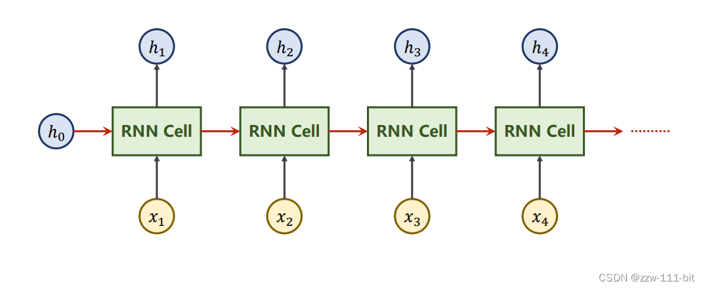
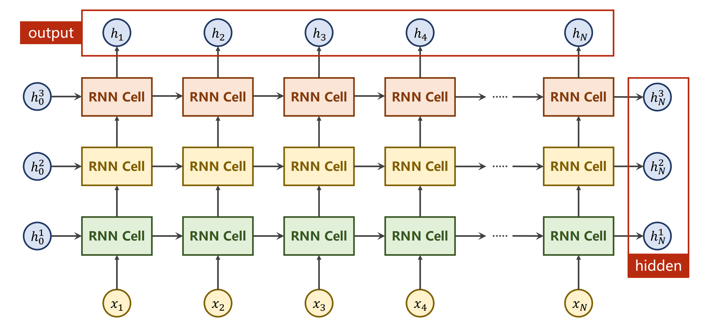
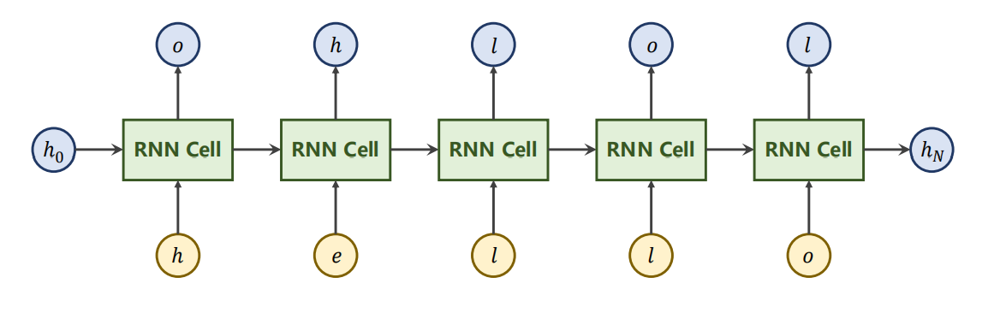
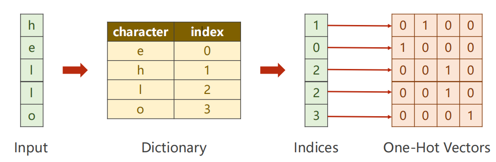

# 目录

- [目录](#目录)
- [RNN (Recurrent Neural Network, 循环神经网络)（基础）🧠](#rnn-recurrent-neural-network-循环神经网络基础)
  - [1. RNN基础概念](#1-rnn基础概念)
    - [1.1 什么是循环神经网络](#11-什么是循环神经网络)
    - [1.2 RNN的核心思想](#12-rnn的核心思想)
  - [RNNCell展开示意图](#rnncell展开示意图)
    - [图片说明：](#图片说明)
    - [1.3 天气预测案例](#13-天气预测案例)
  - [2. RNN的数学原理](#2-rnn的数学原理)
    - [2.1 前向传播公式](#21-前向传播公式)
    - [2.2 隐藏状态的作用](#22-隐藏状态的作用)
  - [numLayers示意图](#numlayers示意图)
    - [图片说明：](#图片说明-1)
  - [3. 字符级RNN实现](#3-字符级rnn实现)
    - [3.1 数据预处理](#31-数据预处理)
    - [字符向量化过程](#字符向量化过程)
    - [输出处理](#输出处理)
    - [3.2 模型定义](#32-模型定义)
    - [3.3 训练过程](#33-训练过程)
    - [3.4 输出结果](#34-输出结果)
  - [4. 代码详解](#4-代码详解)
    - [4.1 参数设置](#41-参数设置)
    - [4.2 数据转换](#42-数据转换)
    - [4.3 模型结构](#43-模型结构)
    - [4.4 训练循环部分](#44-训练循环部分)
    - [4.5 优化器选择](#45-优化器选择)
      - [Adam的优势](#adam的优势)
      - [SGD的特点](#sgd的特点)
      - [为什么这里选Adam？](#为什么这里选adam)

# RNN (Recurrent Neural Network, 循环神经网络)（基础）🧠

---

## 1. RNN基础概念

### 1.1 什么是循环神经网络

循环神经网络（Recurrent Neural Network, RNN）是一类专门处理序列数据的神经网络。与传统的全连接神经网络不同，RNN具有"记忆"能力，能够利用之前的信息来影响当前的输出。

**核心特点：**
- **序列处理**：能够处理任意长度的序列数据
- **参数共享**：在不同时间步使用相同的参数
- **记忆机制**：通过隐藏状态保存历史信息

### 1.2 RNN的核心思想

RNN的核心思想可以用一个简单的比喻来理解：就像人类阅读文章时，我们会记住前面读过的内容，然后结合当前读到的信息来理解整个句子。RNN也是这样，它在处理序列中的每个元素时，都会"记住"之前处理过的信息。

**工作流程：**
1. 接收当前时间步的输入
2. 结合上一个时间步的隐藏状态
3. 计算当前时间步的输出和新的隐藏状态
4. 将新的隐藏状态传递给下一个时间步

## RNNCell展开示意图



*图：RNN在时间维度上的展开示意图。展示了同一个RNN Cell如何在不同时间步被重复使用，通过隐藏状态 $h_t$ 在时间步之间传递信息。*

### 图片说明：

1. **绿色矩形块**：表示RNN Cell，在四个时间步中被重复使用（权重共享）
2. **黄色圆形节点**：表示输入 $x_1, x_2, x_3, x_4$，每个时间步的输入数据
3. **蓝色圆形节点**：表示隐藏状态 $h_0, h_1, h_2, h_3, h_4$，包含历史信息
4. **红色箭头**：表示隐藏状态在时间步之间的传递，这是RNN的核心机制
5. **黑色箭头**：表示输入到RNN Cell和RNN Cell到输出的连接

这个图清楚地展示了RNN的循环特性：每个时间步的隐藏状态 $h_t$ 不仅依赖于当前输入 $x_t$，还依赖于前一时间步的隐藏状态 $h_{t-1}$，从而实现了对序列历史信息的记忆。

### 1.3 天气预测案例

让我们用一个生动的天气预测例子来理解RNN：

假设我们要预测明天的天气，我们有以下数据：
- 今天：晴天 ☀️
- 昨天：阴天 ☁️  
- 前天：雨天 🌧️
- 大前天：晴天 ☀️

传统方法可能只看今天的天气来预测明天，但RNN会考虑整个序列：
- 它"记住"了前几天的天气模式
- 发现"晴天→阴天→雨天→晴天"这个规律
- 基于这个模式预测明天可能是阴天

这就是RNN的"记忆"能力！

---

## 2. RNN的数学原理

### 2.1 前向传播公式

RNN的前向传播可以用以下公式表示：

$$h_t = \tanh(W_{xh} \cdot x_t + W_{hh} \cdot h_{t-1} + b_h)$$

$$y_t = W_{hy} \cdot h_t + b_y$$

其中：
- $x_t$：当前时间步的输入
- $h_t$：当前时间步的隐藏状态
- $h_{t-1}$：上一个时间步的隐藏状态
- $y_t$：当前时间步的输出
- $W_{xh}, W_{hh}, W_{hy}$：权重矩阵
- $b_h, b_y$：偏置项

### 2.2 隐藏状态的作用

隐藏状态（Hidden State）是RNN的"记忆"所在：
- **信息存储**：保存了从序列开始到当前时间步的所有重要信息
- **状态传递**：将信息从一个时间步传递到下一个时间步
- **特征提取**：自动学习序列中的重要特征和模式

## numLayers示意图



*图：多层RNN的结构示意图。展示了不同层数的RNN如何堆叠，每层都有自己的隐藏状态。*

### 图片说明：

- **上标**：不是指数，而是表示不同的层数
- **同色RNNCell**：表示同一个RNN单元在不同时间步的重复使用
- **层间连接**：展示了多层RNN中信息如何在不同层之间传递

要注意的是，在图中同样颜色的RNNCell是同一个，体现了RNN的参数共享特性。

---

## 3. 字符级RNN实现

### 3.1 数据预处理

在我们的实现中，我们使用了一个简单的字符级RNN来学习"hello"到"ohlol"的映射：



*图：字符级RNN的任务示例。输入序列"hello"，输出序列"ohlol"。*

如图，我们输入的序列即是'h','e','l','l','o'，将来隐层的输出就得是'o','h','l','o','l'。

我们遇到的问题就是，此时我们输入的是字符，而并不是一个向量，就会导致现在我们无法计算。

所以，我们第一步就需要把这些字符进行向量化，如下图所示：



*图：字符向量化过程。从字符到索引，再到独热编码的转换过程。*

### 字符向量化过程

在自然语言处理中，我们需要将字符转换为神经网络能够处理的数值形式。这个过程分为几个步骤：

**第一步：构建词典**
首先根据所有可能出现的字符构造一个词典，给每个字符分配一个唯一的索引。在我们的例子中：
- 'e' → 0
- 'h' → 1  
- 'l' → 2
- 'o' → 3

**第二步：字符转索引**
根据词典，将输入序列中的每个字符转换为对应的索引：
- "hello" → [1, 0, 2, 2, 3]

**第三步：索引转独热向量**
将每个索引转换为独热编码向量。独热向量的长度等于词典大小（本例中为4），只有一个位置为1，其余为0：
- 索引0 → [1, 0, 0, 0]
- 索引1 → [0, 1, 0, 0]
- 索引2 → [0, 0, 1, 0]
- 索引3 → [0, 0, 0, 1]

因此，input_size = 4（词典大小）。

### 输出处理

**输出格式**
RNN Cell的输出是一个长度为4的向量，表示对4个字符类别的预测概率分布。

**损失计算**
1. 将RNN输出通过Softmax函数转换为概率分布
2. 与真实标签（独热编码）计算交叉熵损失
3. 使用CrossEntropyLoss进行训练

**输出维度**
output_size = 4（对应4个字符类别）

```python
import torch

input_size = 4
hidden_size = 4
batch_size = 1

idx2char = ['e', 'h', 'l', 'o'] # 字母列表
x_data = [1, 0, 2, 2, 3] # The input sequence is 'hello'
y_data = [3, 1, 2, 3, 2] # The output sequence is 'ohlol'
```

### 3.2 模型定义

```python
class Model(torch.nn.Module):
    def __init__(self, input_size, hidden_size, batch_size):
        super(Model, self).__init__()
        self.batch_size = batch_size
        self.input_size = input_size
        self.hidden_size = hidden_size
        self.rnncell = torch.nn.RNNCell(input_size = self.input_size, hidden_size = self.hidden_size)

    def forward(self, input, hidden):
        hidden = self.rnncell(input, hidden) # h_t = cell(x_t, h_t-1)
        return hidden

    def init_hidden(self): #生成默认的初始h0
        return torch.zeros(self.batch_size, self.hidden_size)
```

### 3.3 训练过程

```python
net = Model(input_size, hidden_size, batch_size)

criterion = torch.nn.CrossEntropyLoss() # 交叉熵损失函数
optimizer = torch.optim.Adam(net.parameters(), lr = 0.1) # 优化器

for epoch in range(15):
    loss = 0
    optimizer.zero_grad() # 优化器梯度归零
    hidden = net.init_hidden() # 初始化hidden(算h0)
    print('Predicted string: ', end='')
    for input, label in zip(inputs, labels): # inputs: seq_len * batch_size * input_size
        hidden = net(input, hidden) # 核心语句,计算h_t
        loss += criterion(hidden, label) # 没有用item(),因为所有序列loss的和才是最终的loss
        _, idx = torch.max(hidden, dim = 1)
        print(idx2char[idx.item()], end='')
    loss.backward()
    optimizer.step()
    print(', epoch [%d/15] loss=%.4f' % (epoch + 1, loss.item()))
```

### 3.4 输出结果
``` 
redicted string: hhhhh, epoch [1/15] loss=7.2311
Predicted string: ohlhh, epoch [2/15] loss=5.7348
Predicted string: ohlol, epoch [3/15] loss=4.5165
Predicted string: ohloh, epoch [4/15] loss=3.8056
Predicted string: ohloh, epoch [5/15] loss=3.4101
Predicted string: ohlol, epoch [6/15] loss=3.0576
Predicted string: ohlol, epoch [7/15] loss=2.7027
Predicted string: ohlol, epoch [8/15] loss=2.5969
Predicted string: ohlol, epoch [9/15] loss=2.5442
Predicted string: ohlol, epoch [10/15] loss=2.4160
Predicted string: ohlol, epoch [11/15] loss=2.2656
Predicted string: ohlol, epoch [12/15] loss=2.1754
Predicted string: ohlol, epoch [13/15] loss=2.1360
Predicted string: ohlol, epoch [14/15] loss=2.0996
Predicted string: ohlol, epoch [15/15] loss=2.0562
```
---

## 4. 代码详解

### 4.1 参数设置

**input_size = 4**  
表示输入特征的维度。由于我们的输入'hello'中有4个字母，所以input_size的值就是4。

**hidden_size = 4**  
是RNN隐藏状态的维度，也可以理解为"记忆单元"的数量。在我们这里将其设置为4，是为了让隐藏状态的维度和输入维度一致，便于理解和调试。

**batch_size = 1**  
表示每次输入RNN样本数量。这里设置为1，表示我们只输入了一个序列。

### 4.2 数据转换

**字母映射**  
```python
idx2char = ['e', 'h', 'l', 'o'] # 字母列表
```
分别将字母'e','h','l','o'的索引设置为0，1，2，3。

**序列转换**  
我们输入的序列是'hello'，转换为张量就是[1, 0, 2, 2, 3]  
输出的序列是'ohlol'，转换为张量就是[3, 1, 2, 3, 2]

**独热编码**  
```python
one_hot_lookup = [[1, 0, 0, 0], [0, 1, 0, 0], [0, 0, 1, 0], [0, 0, 0, 1]]
x_one_hot = [one_hot_lookup[x] for x in x_data]
```

one_hot_lookup 定义了一个"独热编码表"，每一行代表一个字母的 one-hot 编码。例如，第0行 [1, 0, 0, 0] 代表字母 'e'，第1行 [0, 1, 0, 0] 代表字母 'h'，以此类推。

x_one_hot = [one_hot_lookup[x] for x in x_data] 这行代码的作用是：把输入的索引序列 x_data（比如 [1, 0, 2, 2, 3]）转换成对应的 one-hot 向量序列。这样每个数字索引就变成了一个只有一个元素为1，其余为0的向量，方便神经网络处理。

通过这种方式，我们可以把原本用数字表示的字符序列，转化为神经网络能够直接处理的向量形式。每个 one-hot 向量都唯一对应一个字母，这样网络在训练时就能"看到"每个字母的独特身份，而不会混淆。独热编码是文本、分类等任务中常用的预处理方法，能够有效地将离散的类别信息转化为数值型输入，便于后续的模型学习和计算。

**列表推导式语法**  
`x_one_hot = [one_hot_lookup[x] for x in x_data]`

这句代码用的是"列表推导式"语法。它的作用是：遍历 x_data 里的每一个索引 x，然后用 x 去 one_hot_lookup 这个列表里查找对应的 one-hot 向量，把所有查到的 one-hot 向量依次组成一个新列表。这样，原本的 x_data（比如 [1, 0, 2, 2, 3]）就被转换成了一个 one-hot 编码的二维列表，每一行都是一个字母的 one-hot 表示。这样做的好处是可以让神经网络直接处理这些向量，而不是原始的数字索引。

所以说，x_one_hot其实就是一个二位列表，里面每一行都是一个字母的one-hot编码变量。

**张量转换**  
```python
inputs = torch.Tensor(x_one_hot).view(-1, batch_size, input_size)
```

这句代码的作用如下：

首先，`torch.Tensor(x_one_hot)` 是把前面得到的 x_one_hot（一个二维列表）转换成 PyTorch 的张量（Tensor），这样才能被神经网络直接处理。

接着，`.view(-1, batch_size, input_size)` 是对这个张量进行形状调整（reshape）。
- `-1` 表示这一维的长度自动推断（通常是序列长度 seq_len）。
- `batch_size` 表示每次输入的样本数，这里是 1。
- `input_size` 表示每个输入向量的长度，这里是 4。

最终，inputs 的形状就是 (seq_len, batch_size, input_size)，也就是"序列长度 × 批量大小 × 输入特征数"。这种格式正好是 PyTorch RNN 相关模块要求的输入格式。

所以说，这句代码就是把 one-hot 编码的输入数据，变成了神经网络能直接吃的张量，并且调整成了标准的 RNN 输入格式。

**标签处理**  
```python
labels = torch.LongTensor(y_data).view(-1, 1)
```

这句代码的作用如下：

首先，`torch.LongTensor(y_data)` 是把 y_data 这个标签序列（比如 [3, 1, 2, 3, 2]）转换成 PyTorch 的长整型张量（LongTensor），这是因为很多损失函数（比如 CrossEntropyLoss）要求标签必须是 long 类型。

接着，`.view(-1, 1)` 是对这个张量进行形状调整（reshape）。
- `-1` 表示这一维的长度自动推断（通常是序列长度 seq_len）。
- `1` 表示每个标签单独占一列。

最终，labels 的形状就是 (seq_len, 1)，也就是"序列长度 × 1"。这种格式正好适合和 RNN 输出的每一步结果一一对应。

所以说，这句代码就是把原始的标签序列变成了神经网络训练时能直接用的张量，并且调整成了和输入、输出一一对应的标准格式。

**为什么用LongTensor？**  
因为LongTensor用于标签，是因为标签必须是整数类型，如果是float类型就会报错。这是PyTorch的硬性规定，尤其是分类任务和交叉熵损失函数。

### 4.3 模型结构

接下来，就是代码的核心部分，定义Model这个类，把RNNCell封装成了一个小模型。

在__init__方法中，我们会把传入的 input_size、hidden_size 和 batch_size 分别保存为成员变量，并且创建一个 RNNCell 实例进行初始化。

接着呢，定义了一个 forward 前馈方法，也就是模型每次接收到输入数据时，如何一步步计算输出的过程。在 forward 方法里，我们会先初始化一个隐藏状态（hidden），通常用全零向量开始。然后，遍历输入序列的每一个时间步，把当前的输入和上一个隐藏状态一起送进 RNNCell，得到新的隐藏状态。每一步的输出我们都会收集起来，最后把所有时间步的输出拼成一个整体，作为模型的最终输出返回。这样，forward 方法就完整地描述了 RNN 的前向传播流程。

至于init_hidden方法，则是用来生成默认的初始h_0的。

### 4.4 训练循环部分

接着我们来看一下代码的主体循环部分：

```python
net = Model(input_size, hidden_size, batch_size)

criterion = torch.nn.CrossEntropyLoss() # 交叉熵损失函数
optimizer = torch.optim.Adam(net.parameters(), lr = 0.1) # 优化器

for epoch in range(15):
    loss = 0
    optimizer.zero_grad() # 优化器梯度归零
    hidden = net.init_hidden() # 初始化hidden(算h0)
    print('Predicted string: ', end='')
    for input, label in zip(inputs, labels): # inputs: seq_len * batch_size * input_size
        hidden = net(input, hidden) # 核心语句,计算h_t
        loss += criterion(hidden, label) # 没有用item(),因为所有序列loss的和才是最终的loss
        _, idx = torch.max(hidden, dim = 1)
        print(idx2char[idx.item()], end='')
    loss.backward()
    optimizer.step()
    print(', epoch [%d/15] loss=%.4f' % (epoch + 1, loss.item()))
```

这段代码是整个训练过程的核心，我来详细解释一下每一步：

**外层循环：训练轮次**  
`for epoch in range(15)` 表示我们要训练15轮，每一轮都会用同样的数据来训练模型，让模型逐渐学会"hello"到"ohlol"的映射规律。

**初始化阶段**  
- `loss = 0`：每轮训练开始时，把损失值清零
- `optimizer.zero_grad()`：把优化器里的梯度清零，这是必须的，因为PyTorch会累积梯度
- `hidden = net.init_hidden()`：初始化隐藏状态，相当于给RNN一个"空白记忆"

**内层循环：序列处理**  
`for input, label in zip(inputs, labels)` 这行代码很有意思，它同时遍历输入序列和标签序列，每次取出一个输入字符和对应的目标字符。

**核心计算**  
- `hidden = net(input, hidden)`：这是最核心的一句！把当前输入和上一个隐藏状态送进RNN，得到新的隐藏状态
- `loss += criterion(hidden, label)`：计算当前时间步的损失，并累加到总损失中
- `_, idx = torch.max(hidden, dim = 1)`：从RNN的输出中找出概率最大的字符索引
- `print(idx2char[idx.item()], end='')`：把索引转回字符并打印出来，这样我们就能看到模型预测的字符串

**反向传播和更新**  
- `loss.backward()`：计算梯度
- `optimizer.step()`：用梯度更新模型参数

**输出结果**  
最后打印当前轮次和损失值，这样我们就能看到模型训练的进展。

这个训练过程其实就是在教RNN：看到'h'应该输出'o'，看到'e'应该输出'h'，以此类推。通过反复训练，RNN逐渐学会了这个映射规律。

---

### 4.5 优化器选择

为什么这里用Adam优化器，而不用SGD优化器呢？

这是一个很好的问题！其实两种优化器都可以用，但Adam在这个任务上有一些优势：

#### Adam的优势
- **自适应学习率**：Adam会根据每个参数的历史梯度自动调整学习率，对于不同参数使用不同的学习率，这样训练更稳定
- **收敛更快**：通常Adam比SGD收敛得更快，特别是在这种小规模任务上
- **超参数少**：我们只需要设置一个学习率（lr=0.1），而SGD可能需要调整学习率衰减等更多参数

#### SGD的特点
- **简单直接**：SGD就是最基础的梯度下降，逻辑简单易懂
- **理论基础扎实**：SGD的理论分析更成熟
- **在某些任务上表现更好**：比如一些大规模数据集上，SGD可能泛化能力更强

#### 为什么这里选Adam？
因为我们的任务比较简单（只有4个字符的映射），数据量小，Adam的自适应特性能让训练过程更平滑，不容易出现震荡。而且我们不需要调太多超参数，直接用默认设置就能工作得很好。

当然，如果你把代码里的 `torch.optim.Adam` 改成 `torch.optim.SGD`，模型也能训练，只是可能需要调整学习率或者训练更多轮次。

---


**总结** 🎉  
本笔记系统介绍了循环神经网络的基本概念、数学原理和实现方法。通过天气预测的生动案例，帮助理解RNN的"记忆"机制；通过字符级RNN的完整实现，展示了RNN在序列数据处理中的应用。RNN作为深度学习中的重要模型，为自然语言处理、时间序列预测等任务提供了强大的工具。
